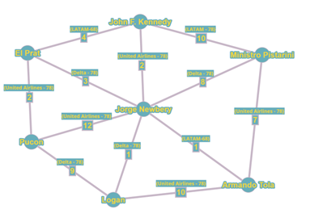
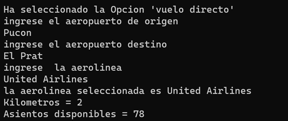
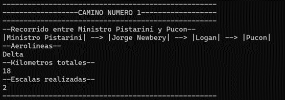
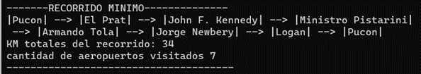

## Tabla de Contenidos

* [Introducción al Problema](#introducci%C3%B3n-al-problema)
* [Implementación de los Servicios 1 y 2](#implementaci%C3%B3n-de-los-servicios-1-y-2)
* [Resolución del Servicio 3](#resoluci%C3%B3n-del-servicio-3)
* [Funcionamiento de la Aplicación](#funcionamiento-de-la-aplicaci%C3%B3n)
* [Conclusiones](#conclusiones)

## Introducción al Problema

El problema que abordamos en este trabajo se centra en la administración de aeropuertos y rutas aéreas. En el contexto actual de viajes aéreos, los viajeros y los organismos de seguridad necesitan información precisa y actualizada sobre los vuelos disponibles, las rutas aéreas y las reservas.

El objetivo principal de nuestro trabajo es desarrollar un sistema que permita registrar todos los aeropuertos habilitados junto con las rutas aéreas que los conectan. Además, el sistema debe mantener un registro de las reservas por día para cada viaje registrado. Este sistema también debe proporcionar servicios útiles para los viajeros, como verificar si existe un vuelo directo entre dos aeropuertos para una aerolínea particular y obtener todos los vuelos disponibles (directos y con escalas) entre dos aeropuertos sin cambiar de aerolínea.

Además, para los organismos de seguridad, el sistema debe ser capaz de encontrar un recorrido que visite todos los aeropuertos una única vez, retornando al aeropuerto de origen, minimizando la cantidad total de kilómetros recorridos.

## Modelado del Problema

El problema aborda un sistema de gestión aeroportuaria que incluye la representación de aeropuertos, rutas entre aeropuertos, reservas de vuelos y servicios relacionados. El modelado del problema incluye múltiples tipos de datos y sus relaciones entre sí.

### Tipos de datos identificados

* **Aeropuerto (Vértice):** Representa un aeropuerto con sus detalles como nombre, ciudad y país.
* **Ruta Aérea (ArcoDatos):** Describe las rutas entre los aeropuertos, incluyendo información sobre aerolíneas, asientos, distancias, y si son vuelos nacionales o internacionales (cabotaje).
* **Reservas (Reservas):** Guarda la cantidad de asientos reservados para vuelos específicos entre aeropuertos.
* **Grafo (Grafo):** Utilizado para representar la red de aeropuertos y las conexiones/rutas entre ellos.

### Estructuras de datos utilizadas

* **Vértice (Aeropuerto):** Se implementa como una estructura con datos de nombre, ciudad y país. Utiliza un mapa para almacenar la relación entre el nombre del aeropuerto y un número asociado.
* **ArcoDatos (Ruta Aérea):** Utiliza mapas anidados para guardar información sobre las rutas entre aeropuertos, aerolíneas asociadas, cantidad de asientos y si son vuelos de cabotaje.
* **Reservas:** Utiliza una estructura con un mapa anidado que almacena la cantidad de asientos reservados entre diferentes aeropuertos y aerolíneas.
* **Grafo:** Implementado como una estructura de grafo con listas de adyacencia, que contiene vértices y arcos.

### Ventajas y desventajas de las estructuras

* **Vértice (Aeropuerto):**

  * Ventajas: Acceso rápido a la información del aeropuerto a través del mapa.
  * Desventajas: Puede conllevar en un mayor uso de memoria debido al almacenamiento de información excesiva.
* **ArcoDatos (Ruta Aérea):**

  * Ventajas: Permite una rápida búsqueda de rutas y aerolíneas asociadas.
  * Desventajas: El uso de mapas anidados puede ser complejo y puede consumir más memoria.
* **Reservas:**

  * Ventajas: Almacena de manera eficiente las reservas de asientos.
  * Desventajas: Puede ser complicado manejar la lógica de reservas si el sistema se vuelve más complejo.
* **Grafo:**

  * Ventajas: Ideal para representar la relación entre los aeropuertos y las rutas entre ellos.
  * Desventajas: Dependiendo de la implementación, la eficiencia de ciertas operaciones (como encontrar caminos) podría verse afectada.

### Complejidad temporal y espacial

Las estructuras de mapas suelen ofrecer una búsqueda eficiente, con complejidad logarítmica O(log n) para inserciones, búsqueda y eliminaciones.
Las listas en un grafo pueden ofrecer una complejidad de O(1) para agregar y eliminar elementos en la lista de adyacencia, pero encontrar caminos (como en un DFS) puede ser de O(MAX(V,E)), donde V es el número de vértices y E el número de aristas.

---

## Implementación de los Servicios 1 y 2

### Servicio 1: Verificación de vuelo directo

**Algoritmo Utilizado:**
El algoritmo se basa en verificar si existe un vuelo directo entre dos aeropuertos dados. Para esto, se comprueba si existe un arco que conecta directamente los dos aeropuertos y si la aerolínea específica seleccionada proporciona este servicio.

**Uso de Tipos de Datos:**

* Grafo y ArcoDatos para verificar la existencia del arco directo entre dos aeropuertos.
* Reservas para comprobar si existen asientos disponibles en la aerolínea seleccionada para el vuelo.

**Pasos:**

1. Tomar aeropuertos de origen y destino.
2. Verificar si existe un arco directo entre estos dos aeropuertos.
3. Comprobar si la aerolínea seleccionada opera en ese arco.
4. Consultar las reservas para verificar la disponibilidad de asientos.

**Complejidad:**

* Verificación de arco directo: O(log n + log m).
* Verificación de asientos en aerolínea: O(log o + log d + log a).

**Ejemplo:**
Aeropuertos: Origen = "Pucon", Destino = "El prat".
Aerolínea: "LATAM".

---

### Servicio 2: Obtener vuelos de la misma aerolínea

**Algoritmo Utilizado:**
Se realiza una búsqueda de caminos mediante DFS en el grafo. Se filtran los caminos que mantienen la misma aerolínea y se verifica la disponibilidad de asientos.

**Complejidad:**

* DFS: O(MAX(V,E)).
* Verificación de asientos: O(log o + log d + log a).

**Ejemplo:**
Aeropuertos: Origen = "Ministro Pistarini", Destino = "Pucon".

---

## Resolución del Servicio 3

Este servicio es un caso del **Problema del Viajante de Comercio (TSP)**. Se analizaron varias alternativas:

* **Fuerza Bruta:** Solución óptima pero factorial O(n!).
* **Heurísticas:** Rápidas, aproximadas, no garantizan optimalidad.
* **Backtracking:** Explora exhaustivamente, garantiza solución óptima, pero poco eficiente en grandes instancias.

**Enfoque elegido:** Backtracking, dado que se usarán datasets pequeños.

**Funcionamiento del Algoritmo:**

1. Comienza con un aeropuerto origen.
2. Prueba recursivamente todas las permutaciones de los aeropuertos.
3. Evalúa costos totales de cada ruta.
4. Selecciona la ruta con menor costo.

**Ejemplo:**

---

## Funcionamiento de la Aplicación

**Entradas:** Archivos de aeropuertos, rutas y reservas.
**Salidas:** Resultados en consola y archivos dentro de `datasets/`.

* Servicio 1 → `Verificacion de Vuelos Directos Entre origen y destino.txt`
* Servicio 2 → `Caminos entre origen y destino.txt`
* Servicio 3 → `Circuito de origen.txt`

---

## Conclusiones

La aplicación ofrece servicios útiles para verificar vuelos, rutas y generar circuitos de aeropuertos.
La principal desventaja es la escalabilidad del algoritmo TSP. Para conjuntos grandes, sería recomendable usar algoritmos heurísticos o aproximados.

**Nota:** El código utiliza un dataset modificado con el grafo mostrado en los ejemplos. Puede usarse otro dataset para validar el funcionamiento.
